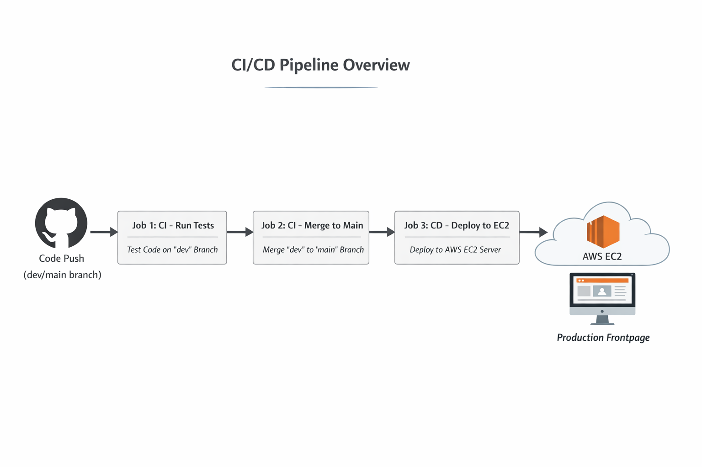

# Sparta Test App – CI/CD Pipeline Documentation

## Overview

This repository demonstrates a **complete CI/CD pipeline** for the Sparta Test App using Jenkins. The pipeline includes **three jobs**: automated testing (Job 1), automatic merging (Job 2), and deployment to an AWS EC2 instance (Job 3).  

**Pipeline Goals:**  
- Automate testing and merging of code changes  
- Securely deploy tested code to production  
- Reduce human error and improve development efficiency  

---

## CI/CD Pipeline Overview

**High-Level Flow:**  
1. Developer pushes code to `dev` branch on GitHub.  
2. **Job 1** runs automated tests on dev branch.  
3. **Job 2** merges dev into main branch if tests pass.  
4. **Job 3** deploys merged code to EC2 and restarts the application.  

**Diagram:**  

---

## Why we set up the CI/CD pipeline this way

- **Automated Testing:** Catches bugs early, ensures only verified code is merged into main.  
- **Automatic Merging:** Reduces human errors and ensures main is always up-to-date.  
- **Automated Deployment:** Speeds up delivery, ensures consistent production environment, reduces manual intervention.  
- **Security & Reliability:** SSH credentials and rsync deployment avoid exposing production code or keys.  
- **Business Value:**  
  - Faster time-to-market  
  - Cost savings via automation  
  - Reduced risk of broken deployments  
  - Improved software quality  

---

## Job Documentation

1. [Job 1 – CI: Run Tests](job1_ci_tests.md)  
2. [Job 2 – CI: Merge dev to main](job2_ci_merge.md)  
3. [Job 3 – CD: Deploy to EC2](job3_cd_deploy.md)  

---
  

## Intro to Jenkins & CI/CD

### What is CI? Benefits?

- **Continuous Integration:** Merging code frequently into a shared repository.  
- **Triggered by:** Developers pushing changes.  
- **Automated Tests:** Unit/integration tests run before integration.  

**Benefits:**  
- Identify and resolve bugs early → reduces costs  
- Maintain stable and functional software builds  

### What is CD? Benefits?

- **Continuous Delivery:** Produces deployable artifact ready for manual deployment.  
- **Continuous Deployment:** Automates deployment to production after successful build.  

**Benefits:**  
- Ensures software is always in deployable state  
- Reduces manual errors  
- Speeds up release cycle  

### What is Jenkins?

- Open-source automation server  
- Primarily used for CI/CD  
- Extensible with 1800+ plugins  
- Scalable using worker nodes/agents  

**Pros:** Automation, extensibility, cross-platform, strong community support  
**Cons:** Can be complex to set up, resource-intensive, UI not modern  

---

## Stages of a Jenkins CI/CD Pipeline

1. **Source Code Management (SCM)** – Fetch code from GitHub.  
2. **Build** – Compile/build the code.  
3. **Test** – Run automated tests.  
4. **Package** – Prepare deployable artifact (if CD).  
5. **Deploy** – Deploy artifact to target environment.  
6. **Monitor** – Track performance/log issues in production.  

---

## Alternatives to Jenkins

- GitLab CI  
- GitHub Actions  
- CircleCI  
- Travis CI  
- Bamboo  
- TeamCity  
- GoCD  
- Azure DevOps (Pipelines)  

---

## Business Value of Building a CI/CD Pipeline

- **Cost Savings:** Automating repetitive tasks  
- **Faster Time to Market:** Quicker deployment cycles  
- **Reduced Risk:** Minimized human errors  
- **Improved Quality:** Automated testing and verification