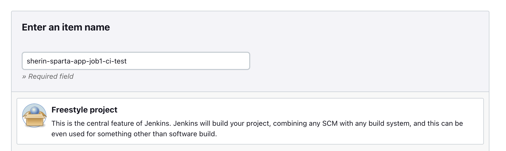
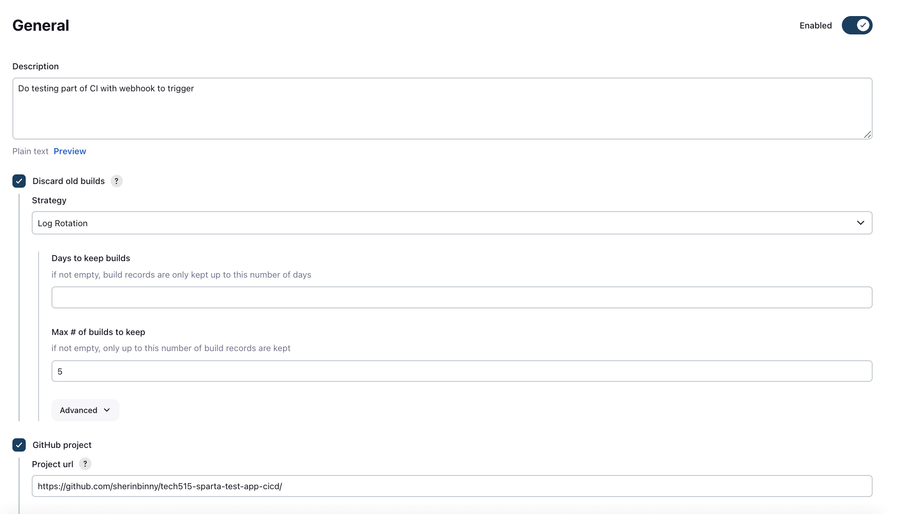
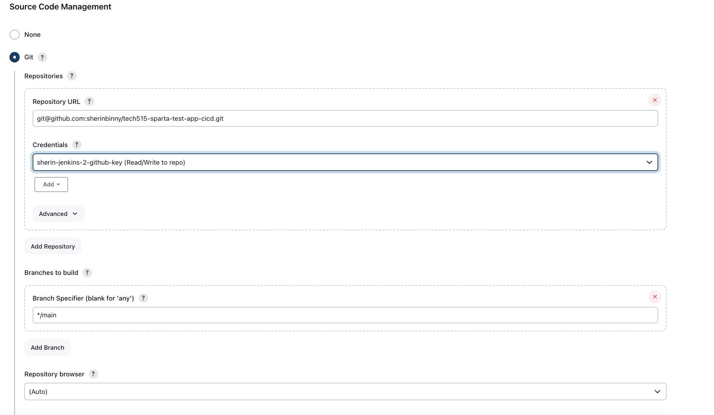
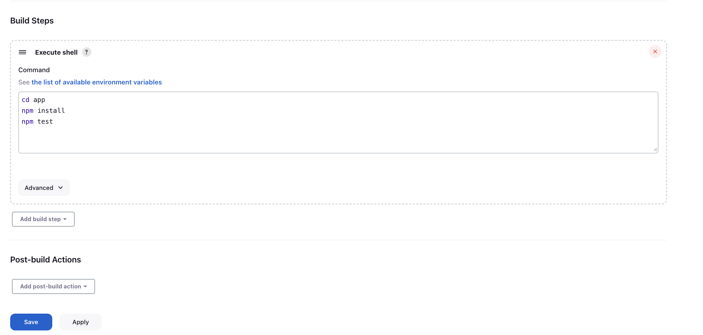
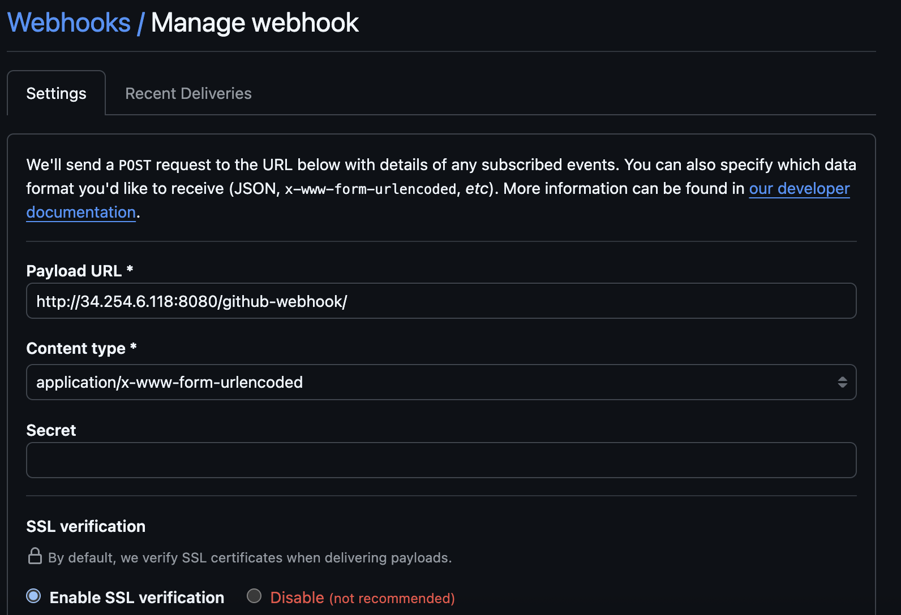
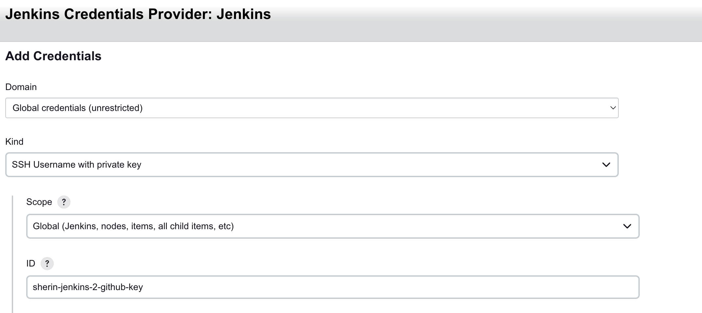
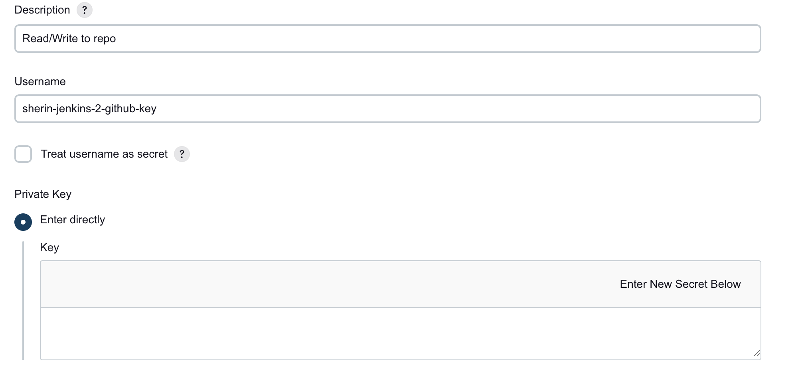
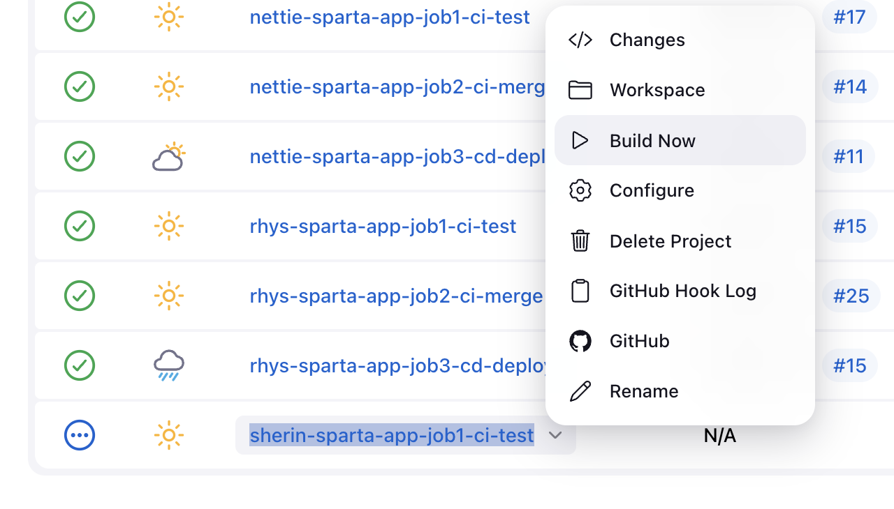
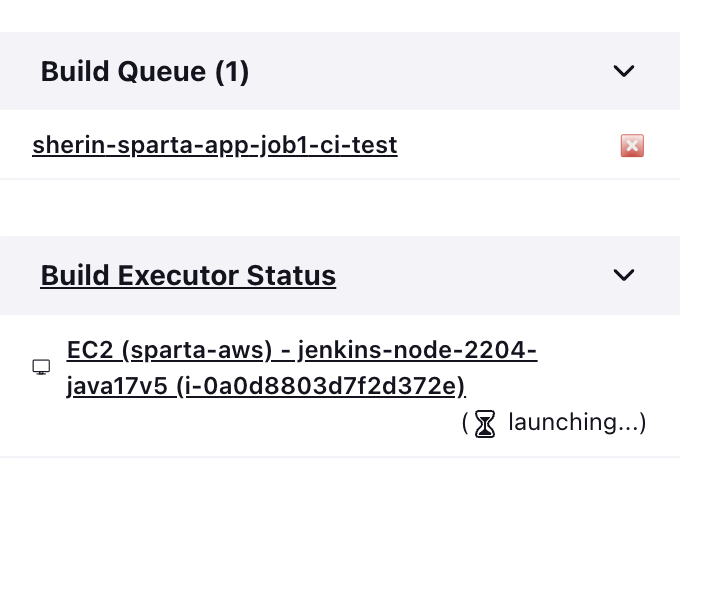
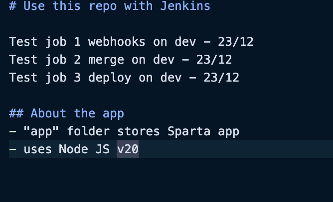

# Jenkins Job 1: Testing Stage with Webhook Trigger

## 1. Objective

The objective of this task was to set up **Job 1 of a Continuous Integration (CI) pipeline** using Jenkins.
This job focuses on the **testing stage**, ensuring that automated tests are run every time code is pushed to the GitHub repository.

The key goals were:

- To integrate Jenkins with GitHub
- To trigger builds automatically using a webhook
- To run Node.js application tests as part of CI
- To verify successful builds using Jenkins console output

---

## 2. Tools & Technologies Used

- **Jenkins** (Freestyle project)
- **GitHub** (Source code repository)
- **AWS EC2** (Jenkins host)
- **Node.js v20**
- **npm**
- **GitHub Webhooks**
- **SSH credentials for secure access**

---

## 3. Jenkins Job Configuration

### 3.1 Job Setup

A Jenkins freestyle project named:

**`sherin-sparta-app-job1-ci-test`**

was created with the following configuration:

- Description: Testing stage of CI triggered via webhook
- Maximum builds to keep: 5 (to manage disk usage)





---

### 3.2 Source Code Management

- Git was selected as the SCM
- Repository URL:

  ```
  git@github.com:sherinbinny/tech515-sparta-test-app-cicd.git
  ```

- Credentials used:
  **sherin-jenkins-2-github-key**
- Branch specifier:

  - Initially tested on `main`
  - Final configuration: `*/dev`



---

### 3.3 Build Trigger Configuration

The option **“GitHub hook trigger for GITScm polling”** was enabled.

This allows Jenkins to start a build **automatically** whenever GitHub sends a webhook notification after a push event, rather than relying on manual builds or scheduled polling.


---

### 3.4 Build Environment Setup

- Node & npm binaries were added to the PATH
- Node.js version **20** was selected

This ensures consistency between local development and the CI environment.

---

### 3.5 Build Steps (Testing Stage)

The following shell commands were added:

```bash
cd app
npm install
npm test
```

These steps:

1. Navigate to the application directory
2. Install required dependencies
3. Run automated tests to validate the application



---

## 4. GitHub Webhook Setup

A webhook was configured in the GitHub repository with:

- Payload URL pointing to the Jenkins server
- Content type set to `application/json`
- Triggered on push events

This allows GitHub to notify Jenkins instantly whenever code changes are pushed.



---

## 5. Credentials Configuration

An SSH key (`sherin-jenkins-2-github-key`) was added to Jenkins credentials to securely authenticate Jenkins with GitHub.

[Learn how to create an SSH key](add-github-ssh-key.md)

Using SSH credentials is more secure than username/password authentication and is the recommended industry approach for CI/CD pipelines.




---

## 6. Build Execution & Verification

- A manual build was triggered initially to verify the configuration



- Jenkins successfully initiated the build on the EC2 instance



- Changes were made to the `README.md` file on both the `main` and `dev` branches



- Each push automatically triggered a new Jenkins build via the webhook
- All builds completed successfully, indicated by a **green status icon**


---

## 7. Lessons Learned

- Code is automatically tested on every push
- Errors are caught early before deployment
- Developers receive immediate feedback
- Manual testing and human error are reduced