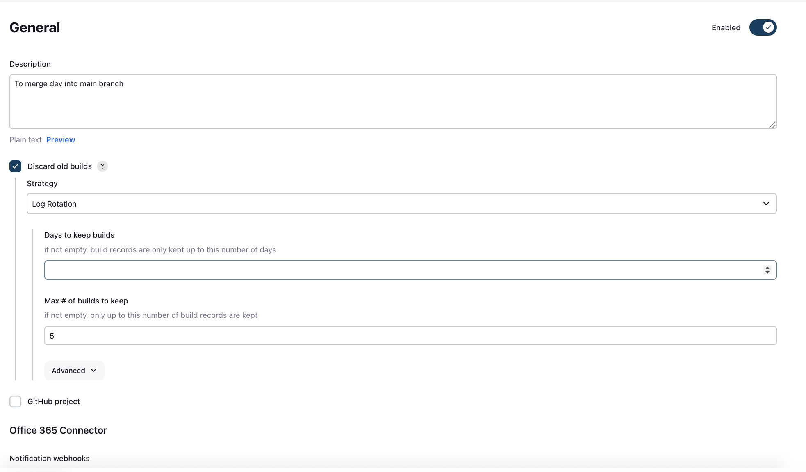
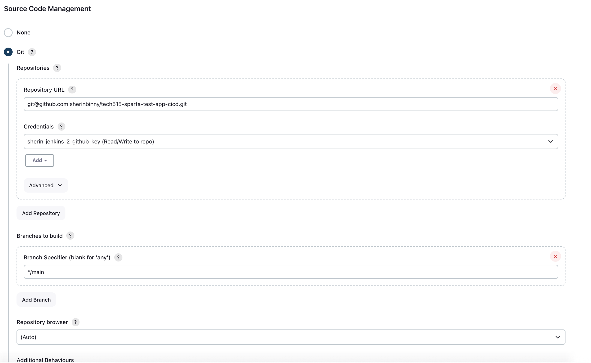
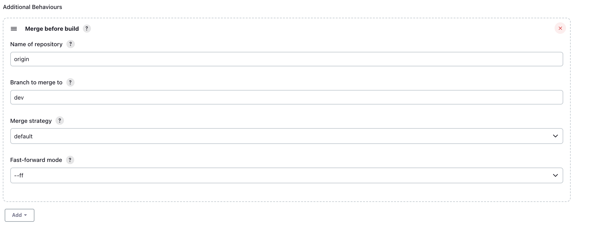
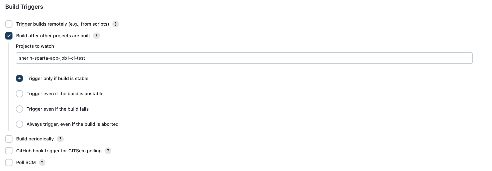
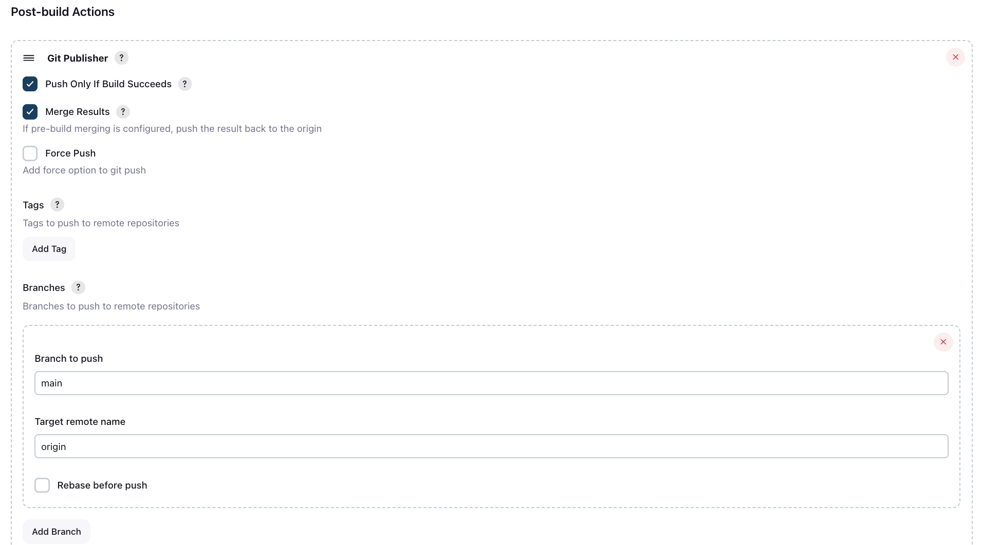
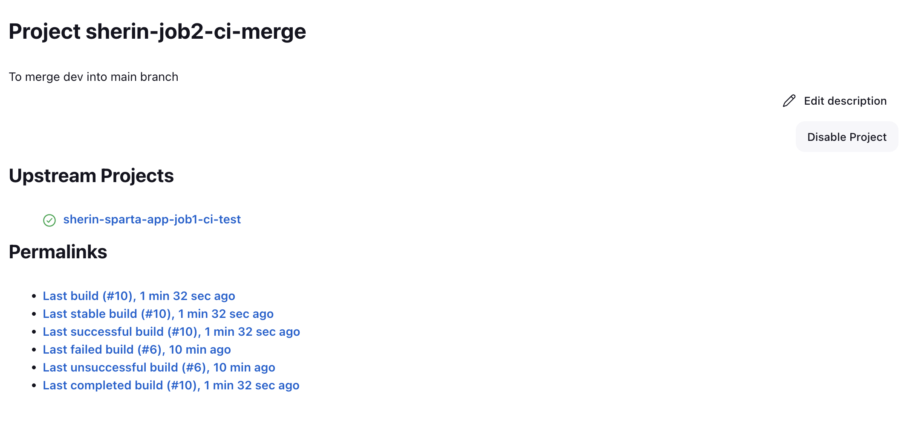

# Jenkins Job 2: Automated Merge

- [Jenkins Job 2: Automated Merge](#jenkins-job-2-automated-merge)
  - [1. Objective](#1-objective)
  - [2. Jenkins Job Configuration](#2-jenkins-job-configuration)
    - [2.1 Job Setup](#21-job-setup)
    - [2.2 SCM Configuration](#22-scm-configuration)
    - [2.3 Build Triggers](#23-build-triggers)
    - [2.3 Post-Build Actions – Git Publisher](#23-post-build-actions--git-publisher)
  - [3. Testing the Flow](#3-testing-the-flow)
  - [4. Challenges](#4-challenges)
  - [5. Lessons Learned](#5-lessons-learned)

## 1. Objective

The purpose of Job 2 is to automate the process of merging the `dev` branch into the `main` branch after ensuring that all CI tests on Job 1 pass. This is important because:

* It ensures only tested, stable code reaches the `main` branch.
* Reduces manual intervention and human error in merging.
* Demonstrates the integration of continuous integration (CI) and continuous deployment (CD) concepts.

---

## 2. Jenkins Job Configuration

### 2.1 Job Setup

A Jenkins freestyle project named:

**`sherin-sparta-app-job2-ci-merge`**

was created with the following configuration:

- Description: To merge dev into main branch
- Maximum builds to keep: 5 (to manage disk usage)

---

### 2.2 SCM Configuration

* Repository: `git@github.com:sherinbinny/tech515-test-app-cicd.git`
* Credentials: `sherin-jenkins-2-github-key` (Read/Write)
* Branch Specifier: `main`

* Additional Behavior – Merge Before Build: Merge `dev` into `main` before building

**Why:** Ensures the workspace has combined code before build and push.

---

### 2.3 Build Triggers

* Configured Job 2 to trigger **after Job 1 succeeds**.
* Watched project: `sherin-sparta-app-job1-ci-test`

**Why:** Guarantees that only tested code is merged into `main`.

---

### 2.3 Post-Build Actions – Git Publisher

* Enabled “Push Only If Build Succeeds”
* Enabled “Merge Results”
* Branch to push: `main`
* Target remote: `origin`

**Why:** Automates the merge and ensures that only successfully built code reaches GitHub.

---

## 3. Testing the Flow

* Pushed a change to `dev`.
* Verified Job 1 ran and passed.
* Job 2 triggered automatically.
* Checked console output to confirm `dev` was merged into `main` successfully.
* Verified GitHub `main` branch was updated.

---

## 4. Challenges

* **Merge conflicts**: Initially Job 2 failed due to conflicts in `README.md`.

  * Solution: Cleaned up branches locally, ensured `dev` and `main` were aligned.
* **Plugin limitations**: Git Publisher cannot resolve merge conflicts automatically, freestyle jobs require clean fast-forward merges.
* **Branch management**: Learned the importance of keeping `dev` in sync with `main` in a CI/CD pipeline.

---

## 5. Lessons Learned

* Automating repetitive tasks (merges, pushes) safely.
* Understanding the limitations of tools and knowing when manual intervention is needed.
* Integrating CI and CD to maintain code quality and reduce errors.