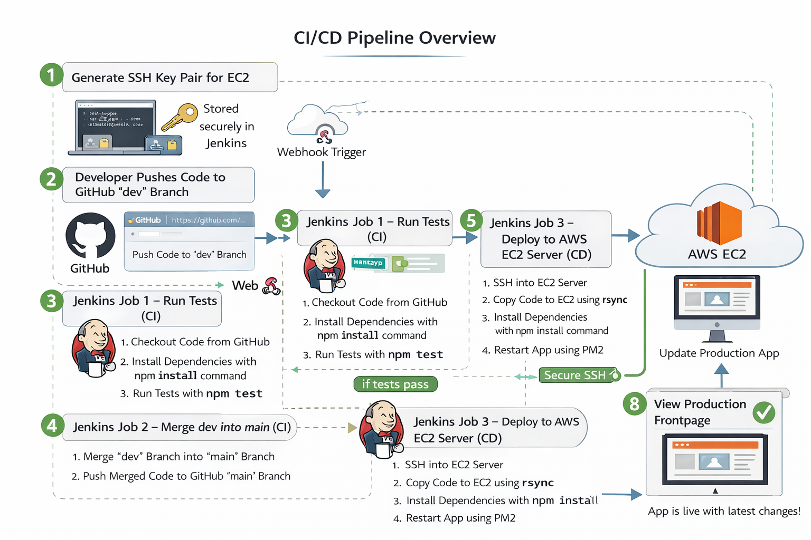
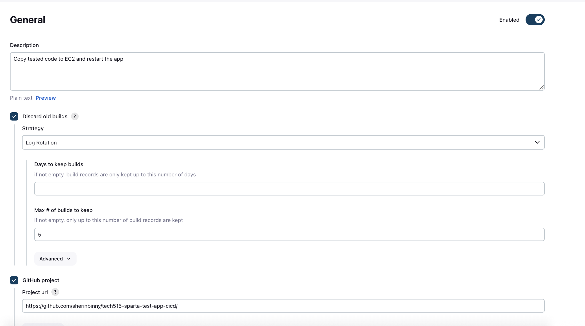
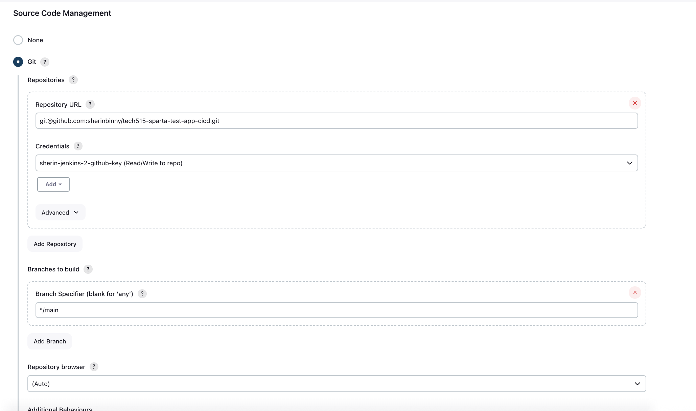
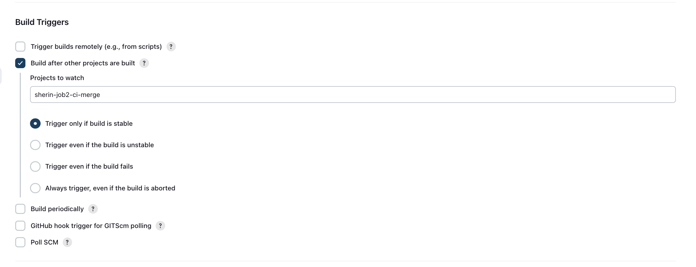
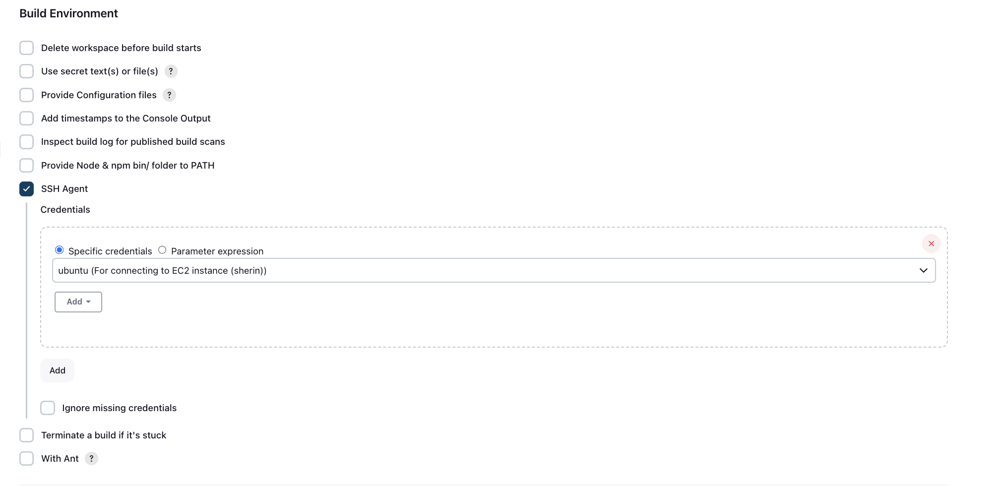
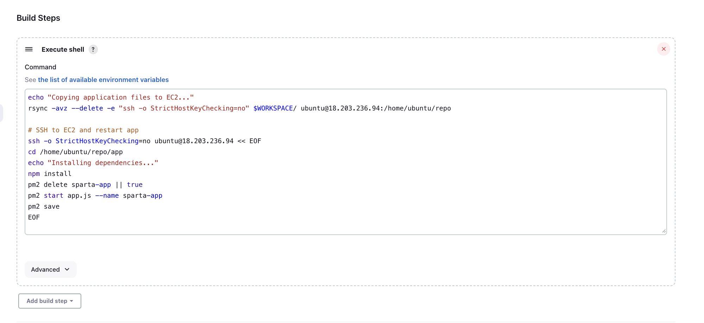
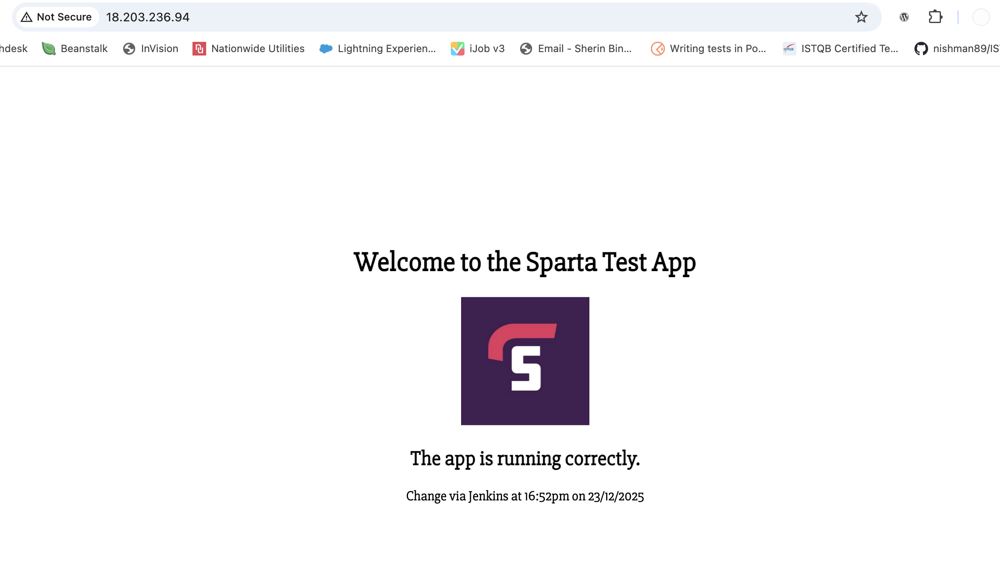
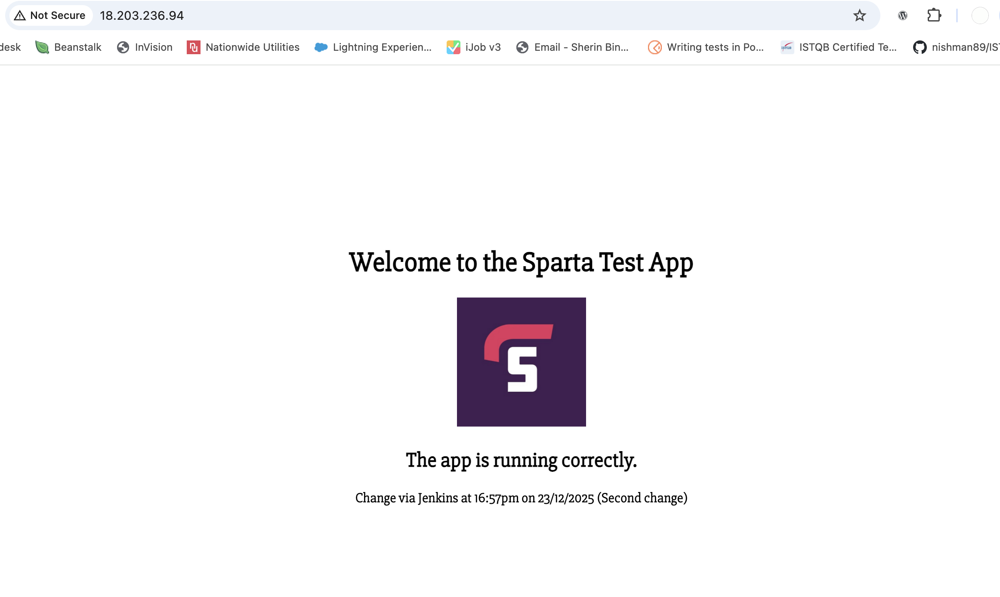

# Jenkins Job 3: Continuous Deployment to AWS EC2

## 1. Objective

Job 3 is the final step in our CI/CD pipeline, responsible for **deploying the tested and merged code to the production EC2 instance**. It ensures that any change pushed to the `dev` branch and successfully merged into `main` is automatically deployed and reflected on the production frontpage.

---

## 2. Overall Pipeline Diagram



* **Automate deployment:** Eliminate manual copying and restarting of the app.
* **Ensure reliability:** Every successful merge to `main` triggers a deployment.
* **Maintain security:** Use SSH key credentials instead of exposing passwords.
* **Enable fast recovery:** PM2 ensures the app is restarted cleanly.

---

## 3. Jenkins Job Configuration

### 3.1 Create Job in Jenkins

* **Job Name:** `sherin-job3-cd-deploy`
* **Type:** Freestyle project
* **Description:** Copy tested code to EC2 and restart the app
* **Max Builds to Keep:** 5
* **GitHub Project URL:** [tech515-sparta-test-app-cicd](https://github.com/sherinbinny/tech515-test-app-cicd)



---

### 3.2 Source Code Management

* **Repository:** `git@github.com:sherinbinny/tech515-sparta-test-app-cicd.git`
* **Credentials:** `sherin-jenkins-2-github-key` (Read/Write access)
* **Branch Specifier:** `main`



* **Why:** Job 3 always deploys production-ready code from `main`.

---

### 3.3 Build Triggers

* **Trigger:** Build after other projects are built
* **Project to Watch:** `sherin-job2-ci-merge`



* **Why:** Ensures Job 3 only runs **after dev code is tested and merged into main**.

---

### 3.4 Build Environment

* **Use SSH Agent:** Yes
* **Credentials:** EC2 SSH key (`ubuntu`)



* **Why:** SSH key provides secure access to the EC2 instance for deployment.

---

### 3.5 Execute Shell Script

```bash
echo "Copying application files to EC2..."
rsync -avz --delete -e "ssh -o StrictHostKeyChecking=no" $WORKSPACE/ ubuntu@18.203.236.94:/home/ubuntu/repo

# SSH to EC2 and restart app
ssh -o StrictHostKeyChecking=no ubuntu@18.203.236.94 << EOF
cd /home/ubuntu/repo/app
echo "Installing dependencies..."
npm install
pm2 delete sparta-app || true
pm2 start app.js --name sparta-app
pm2 save
EOF
```



**Explanation of Script:**

1. `rsync -avz --delete`: Copies all code from Jenkins workspace to EC2, excluding no files (can exclude `.git` or `node_modules` if desired).
2. `ssh -o StrictHostKeyChecking=no`: Connects to EC2 without interactive prompts.
3. `npm install`: Installs required Node.js dependencies.
4. `pm2 delete sparta-app || true`: Stops any existing app instance, ignores errors if none exists.
5. `pm2 start app.js --name sparta-app`: Starts the app with PM2 under a specific name.
6. `pm2 save`: Saves PM2 process list to ensure restart persistence on server reboot.

---

## 4. Security and Authentication

* SSH key for EC2 securely stored in Jenkins credentials.
* No passwords exposed in scripts.
* SSH Agent ensures the private key is available only for the job runtime.

---

## 5. Testing the Deployment

**Steps:**

1. Make a change on the frontpage in the `dev` branch (e.g., update date & time).
2. Commit and push to GitHub.
3. Jenkins Job 1 runs tests.
4. If tests pass, Job 2 merges `dev` into `main`.
5. Job 3 copies the updated code to EC2, installs dependencies, and restarts the app.
6. Verify the change appears on the production frontpage.





Changes were reflected within a minute or two. Multiple changes were pushed and deployed successfully, confirming reliability.

---

## 6. Lessons Learned

* Reduced manual errors during deployment.
* Faster updates visible on the frontpage.
* Security maintained via Jenkins credentials and SSH.
* rsync + SSH is a cleaner approach than git clone on production.
* Testing each stage separately helps identify failures before production impact.

---

## 7. Testing Links


**Notes:** This confirms that the pipeline successfully updates production with every change pushed to `dev`.